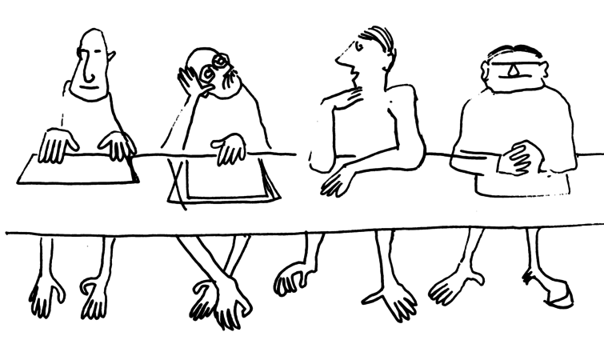

```python
# This cell is present in all the notebooks.
# It makes the necessary packages available and adjusts various settings.
# You should execute this cell at the start.

import sys
sys.path.append('../../code')
from init_mooc_nb import *
init_notebook()

from IPython.display import HTML
```

# A welcome word

First of all, greetings from the TOPOCMx team! We are very happy that you chose to follow our course.

Through TOPOCMx we want to provide an introduction to the new topics on topology in condensed matter.
We want it to be simple, and we want it to be useful for people with very different background and motivation.

We want the course to be useful to you if you are a **master student**, and you want to get an understanding of what topology is all about.

Or you could be a **PhD student or a postdoc** doing experiments, and you want to get a better theoretical understanding of what you should expect in your investigations.

You could even be a **theorist working in topology** and be extremely familiar with topological invariants and vector bundles, but you would like to get a better understanding of how the mathematical ideas apply in physical systems.

Finally, we also want this course to be equally useful if you are, say, a **professor working in condensed matter** and you want to apply the ideas introduced by topology in your domain, so that you just need a quick overview of what research activity is there.

But even despite your different backgrounds, we want our course to feel like this:


rather than this:



*(Images by Bruno Touschek, © 1981 [CERN](http://cds.cern.ch/record/135949) CC-BY-3.0)*

### What you get

Let us explain what you can expect from the course, and what is special about it.
The first thing which you need to understand is that the course is hard.
We don't mean advanced and involved math (we took care to skip all the parts that don't help understanding).
Instead, since topology has impact on many different physical phenomena, the course will touch a lot of different concepts in condensed matter physics.

First of all, we will provide you with a description of the most **important facts and discoveries in topology** in the most simple and concise manner that we can find.

This will still be hard to some of you, since the required background in condensed matter physics is still broad.
If you see that it is the case, you will need to search for advice in the course **discussions**, so you'll also use the course as an expert community.

If you are experienced already, you may find the lectures straightforward.
However, even though active research on topological insulators began less than ten years ago,
the field is already incredibly broad.

This is why we want our course to also fulfill a role of a **journal club**:
every week we'll ask you to read one of several suggested papers, observe how the concepts that you learn
appear in a new context, and summarize it for the other participants.
That way you will learn to analyze research papers and get an **overview of the field**.

Most of the numerical simulations that are used in our research are actually amazingly easy if you know how to do them.
While teaching how to do computer simulations is not our main aim, we provide already set up simulations for the systems we describe in the lectures.

Using these **computer simulations** you can see for yourself how various models behave, discover new parameter regimes that we don't cover in the lectures, or even extend the simulations and see how adding new terms to the models changes the results.

### How you can help us

MOOCs like this one are not a usual way for providing graduate-level materials, and even less so materials that are a topic of active research.

We believe that it is a very useful and promising way of knowledge dissemination, that has advantages over a book, a university course, or a review.

This is why it is extremely important for us to know what is your background and your motivation to take the course.
We want you to share what you found difficult, what you found easy, and where you think the course can be improved.

Moreover, we publish the **source code** for every single bit of this course in this [Github repository](https://github.com/topocm/topocm_content).
So whenever you see a typo, or you would like to suggest an improvement, you can open a new issue, (or even make a pull request if you know how to use Github).

# Software you will need

If you don't want to be bothered trying out the numerical simulations, you are all set if you have an EdX account and you are signed up for the course.

However we strongly recommend to not skip the numerical simulations part. Following it will help you to develop intuition about how the topological systems behave. The numerical simulations can also serve as an extremely useful tool helping both in experiments and theory.

To get going with the simulations, you will need to get the computational software.
Specifically you need:

* Python 3.5 or 3.6
* Python scientific stack (SciPy, NumPy, Matplotlib, Jupyter notebook)
* Holoviews 1.7, a Python library for plotting data.
* [Kwant](http://kwant-project.org) 1.3, a package for quantum transport simulations.

The installation should be straightforward.
Installation of most of the requirements is described [here](http://kwant-project.org/install).

If you are using Windows, you are all set after following the above instructions.

The easiest way to install `kwant` when you are using Linux or OS X is with `conda` which comes with Miniconda, a Python distribution.

1. Open a terminal and download [Miniconda](http://conda.pydata.org/miniconda.html>)
   (or [Anaconda](https://www.continuum.io/downloads)) by running:

       wget https://repo.continuum.io/miniconda/Miniconda3-latest-MacOSX-x86_64.sh

2. Install Miniconda with:

       bash Miniconda3-latest-MacOSX-x86_64.sh

   and follow its instructions. Make sure that ``conda`` is in your PATH, which you
   can do by adding ``export PATH="$HOME/miniconda3/bin:$PATH"`` to your ``.bashrc``
   or ``.bash_profile``.

3. Add the [conda-forge](https://conda-forge.github.io/) channel and install
   Kwant and its dependencies with:

       conda config --add channels conda-forge
       conda install kwant holoviews notebook feedparser

### Jupyter notebooks

A separate mention of the software we use goes to Jupyter notebooks.

Every document that you see in our course (including the one that you are reading right now) was prepared as a Jupyter notebook.

These notebooks are extremely handy, they allow:

* To use an interactive computing environment where you can see what your simulation does right as you are creating it.
* To combine nicely formatted text (with Latex equations and images) together with code in any language and the output of that code.
* To easily share that same code: here, take a look at the source of [the notebook](http://nbviewer.ipython.org/github/topocm/topocm_content/blob/master/w0_background/intro.ipynb) that you are currently reading.
* To convert it to a presentation, blog post, or an EdX course.

The combination of the above nice properties with many more and with Jupyter being free software lead to the notebooks being [highlighted](http://www.nature.com/news/interactive-notebooks-sharing-the-code-1.16261) in Nature.

For a short presentation of Jupyter notebooks just use `Help -> User Interface Tour` inside the notebook.

### Sharing notebooks

Showing the results of your work is very easy.

If you are using Sage Cloud, you can just click the "share the notebook" button when you have it opened, and copy the URL.

Otherwise you can make the notebook visible online (for example by putting it in your Dropbox public folder or something similar), copy link, and paste it into [http://nbviewer.ipython.org](http://nbviewer.ipython.org).

### Kwant, Python, and Python scientific software

For most of the simulations of condensed matter systems we are going to use the Kwant package. You can learn Kwant in more detail by following the [tutorial](http://kwant-project.org/doc/1.0/tutorial/), however we aim that for most of the exercises you will be able to learn by doing. The starting point of the exercises are the notebooks used in the lectures, and you should be able to solve them by only modifying the contents not too much.

The same applies to Python and the Python scientific stack (NumPy, SciPy, Matplotlib): these are easy to use, especially when you have code examples. If you are new to programming and wish to get acquainted with Python,
[here](http://www.learnpython.org/) are [several](http://www.python-course.eu/) [example courses](https://www.codecademy.com/learn/python) that start from the basics and slowly go into advanced topics. There are of course several MOOCs as well, but you will likely not need as much programming skill.

**Do you have questions about installation? Use this discussion:**


```python
MoocDiscussion('Software', 'Help with installation')
```

# Literature

We are mostly going to focus on the overall structure of the field and study the most basic and general phenomena. We will also skip detailed derivations or some details.

For a more formal and complete source of information on topological insulators and superconductors we recommend you to look into the reviews below. (Of course we think they will be much easier to follor after you finish the course).


## Topological insulator reviews

* arXiv:0801.0901
* arXiv:1002.3895
* arXiv:1008.2026

## Majorana fermion reviews

* arXiv:1112.1950
* arXiv:1202.1293
* arXiv:1206.1736
* arXiv:1407.2131

## Advanced topics: Fractional particles and topological quantum computation

* arXiv:0707.1889
* arXiv:0711.4697
* arXiv:1404.0897

## Extra topics

* arXiv:1211.5623
* arXiv:1501.00531
