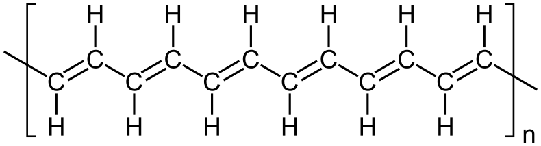

---
jupytext:
  text_representation:
    extension: .md
    format_name: myst
    format_version: 0.13
    jupytext_version: 1.11.4
kernelspec:
  display_name: Python 3
  language: python
  name: python3
---

# Brief review of band structures

```{code-cell} ipython3
:tags: [remove-cell]

import sys

sys.path.append("../code")
from init_course import *

init_notebook()
```

## A quick review of band structures

For the material of this course we assume familiarity with basic linear algebra, quantum mechanics and solid state physics.
In this chapter, we briefly review the concepts most relevant to this course. 
If you think you know how you would proceed if you are given to compute the bandstructure of graphene then you can likely skip this chapter.

### Quantum mechanics: electrons as waves
Quantum mechanics begins with stating that particles such as electrons should really be treated
as waves. These waves are described by the famous Schrodinger equation

$$
i\hbar\partial_t \Psi = H\Psi,
$$

where at this point $\Psi$ is the "wave-function" and $H$ is the Hamiltonian. 
The problem of analyzing this Schrodinger equation can be reduced to the eigenvalue problem in linear algebra, though in many cases the vector space might be infinite dimensional.
In the following, we assume familiarity with basic finite dimensional linear (matrix) algebra.

#### Schrodinger equation besides electrons
Our main focus is quantum-mechanical systems, however, as we will see, many ideas apply also in completely classical context of sound propagation and elasticity.
To see this, let us  convert a familiar wave-equation for a string in to a Schrodinger-like form.
You must have seen a wave-equation for a string that looks like

$$
\partial_t^2 h-c^2\partial_x^2 h=0,
$$

where $h(x,t)$ is the vertical displacement of the string.
This wave-equation is second order in time.
Let's try to make it first order like the Schrodinger equation by defining $h_1(x,t)=c^{-1} \partial_t h(x,t)$ and $h_2(x,t)=\partial_x h(x,t)$. 
After doing this we see that our wave-equation turns into a pair of equations that are linear order in time:

$$
\partial_t h_2 = c\partial_x h_1\textrm{, and }\partial_t h_1=c\partial_x h_2.
$$

We can turn this into the Schrodinger equation if we define:

$$
\Psi(x,t)=\left(\begin{array}{c}h_1(x,t)\\h_2(x,t)\end{array}\right)\quad H=c\left(\begin{array}{cc}0& 1\\1 & 0\end{array}\right)(i\partial_x).
$$

Now those of you who know basic quantum mechanics might say this is a very strange Schrodinger equation.
But this indeed is the wave-function for helical Majorana particles that we encounter later on.

#### Applying the Schrodinger equation
The wave-function $\Psi$ in the Schrodinger equation that describes electrons is typically a complex though the Hamiltonian is not a matrix (thankfully):

$$
H=-\frac{\hbar^2}{2m}\partial_x^2 + V(x),
$$

where $m$ is the mass of the electron and $V(x)$ is the background potential energy over which the electron is moving.

The main things that you should remember about wave equations for electrons are:  

* $\Psi(x,t)$ is complex, 
* $H$ is a Hermitian  matrix or operator 
* density of electrons are related to $|\Psi(x,t)|^2$.
* If $N$ is the number of electrons, one must occupy $N$ orthogonal wave-functions.

The last point is more subtle and is called the **Pauli exclusion principle**. We elaborate on orthogonality later.

Since we are interested in static properties of electrons in materials for much of our course, it helps to make the simplifying ansatz: $\Psi=e^{-i E t/\hbar}\psi$.
This ansatz simplifies the Schrodinger equation to a time-independent form:

$$
H\psi=E\psi,
$$

which is an eigenvalue problem in linear algebra.

We can often model electrons in materials within the  **tight-binding** approximation where electrons are assumed to occupy a discrete set of orbitals. 
We then take $\psi_a$ to be the wave-function of the electron on orbital $a$. 
The wave-functions $\psi_a$ can be combined into $\psi$, which is then a vector.
In this case, the Hamiltonian $H$ becomes a matrix with components $H_{ab}$.
These definitions transform the time-independent Schrodinger equation into a matrix eigenvalue problem from linear algebra.
Once we know how to set-up the matrix $H_{ab}$ to model a particular material, we can extract the properties of the material from the wave-function components $\psi_a$ and energy (eigenvalue) $E$. 
A few key properties of the Schrodinger equation $H\psi^{(n)}=E^{(n)}\psi^{(n)}$ are: 
* if $H$ is an $N\times N$ matrix, the eigenvalue index $n$ goes from $n=1,\dots,N$. 
*  $H$ is Hermitian i.e. $H_{ab}=H_{ba}^*$. 
* Eigenstates are orthogonal i.e. $\psi^{(n)\dagger} \psi^{(m)}=0$ for $m\neq n$.

+++

Physicists have a convenient notation for doing linear algebra called the Dirac **bra-ket** notation. 
In this notation, wave-functions such as $\psi$ are represented by **kets** i.e. $\psi\rightarrow |\psi\rangle$. 
We construct the ket $|\psi\rangle$ from the components of the wave-function $\psi_a$ using the equation:

$$
|\psi\rangle=\sum_a \psi_a |a\rangle.
$$

Similarly, we turn the Hamiltonian $H$ in to  an **operator** using the equation :

$$
H=\sum_{ab}H_{ab}|a\rangle \langle b|,
$$

where $H_{ab}$ are the elements of the matrix $H$ from the last paragraph. 
We call the object $\langle b|$ a **bra** and together with the ket it forms a bra-ket with the property $\langle b| a\rangle=\delta_{ab}$.
The Schrodinger equation now looks like

$$
H|\psi\rangle = E|\psi\rangle,
$$

which can be checked to be the same equation as the linear algebra form. 

#### Example: Atomic triangle
Let's now work out the simple example of electrons moving in a triangle of atoms, where each atom has one orbital. We label the orbitals as $|0\rangle,|1\rangle,|2\rangle$. 
With this labeling, the **hopping** amplitude $t$ of electrons between orbitals has the Hamiltonian

$$
H=-t(|0\rangle \langle 1|+|1\rangle \langle 2|+|2\rangle \langle 0|)+h.c,
$$

where $h.c.$ stands for Hermitian conjugate, which means that you reverse the ordering of the labels and take a complex conjugate. 
We can also write the Hamiltonian in matrix form

$$
H_{ab}=-\left(\begin{array}{ccc}0&t&t^*\\t^*&0&t\\t&t^*&0\end{array}\right).
$$

Diagonalizing this matrix is a straightforward exercise that results in three eigenvectors $\psi^{(n)}_a$ (with $n=1,2,3$)
corresponding to energy eigenvalues

$$
E^{(n)}=-2 |t| \cos{\theta},|t|\cos{\theta}\pm |t|\sqrt{3}\sin{\theta}
$$

(where $t=|t|e^{i\theta}$).
The corresponding eigenvectors

$$
\psi^{(n)}_a=3^{-1/2}(1,1,1),3^{-1/2}(1,\omega,\omega^2),3^{-1/2}(1,\omega^2,\omega)
$$

where $\omega$ is the cube-root of unity (i.e. $\omega^3=1$).

### Bloch's theorem for bulk electrons

Actually, we can even solve the problem of an electron in an N site ring (triangle being $N=3$).
The trick to doing this is a neat theorem called Bloch's theorem.
Bloch's theorem is the key to understanding electrons in a crystal. 
The defining property of a crystal is that the atomic positions repeat in a periodic manner in space.
We account for ALL the atoms in the crystal by first identifying a finite group of orbitals called the **unit-cell**.
We choose the unit-cell so that we can construct the crystal by translating the unit cell by a discrete set of vectors called lattice vectors to $n$.
We label the orbitals in the unit-cell by the index $l$, which takes a finite set of values.
By combining the unit cell and the lattice vectors, we  construct positions $a=(l,n)$ 
of all the orbitals in the crystal.
For our example of an atomic ring of size $N$, the index $l$ wouldn't be needed since there is only one orbital per unit-cell and $n$ would take values $1$ to $N$.
In a three-dimensional crystal, $n=(n_x,n_y,n_z)$ would be a vector of integers. 
The Hamiltonian for a crystal has matrix elements that satisfy $H_{(l,n),(l',m)}=H_{(l,n-m),(l',0)}$ for all pairs of unit-cell $n$ and $m$. 

> Bloch's theorem states that the Schrodinger equation for such Hamiltonians in crystals can be solved by the ansatz:
>
> $$
  \psi_{(l,n)}=e^{i k n}u_l,
  $$

where $u_l$ is the periodic part of the Bloch function which is identical in each unit-cell.

The parameter $k$ is called crystal momentum and is quite analogous to momentum (apart from a factor of $\hbar$)
except that it is confined in the range $k\in [-\pi,\pi]$ which is referred to as the **Brillouin Zone**.
You can now substitute this ansatz into the Schrodinger equation: $\sum_{l'm}H_{(l,n),(l',m)}u_{l'}e^{i k m}=E(k) e^{i k n}u_{l}(k)$. 
 Thus the Bloch functions $u(k)$ and energies $E(k)$ are obtained from the eigenvalue equation (so-called Bloch equation)

$$
H(k)u(k)=E(k)u(k),
$$

where

$$
H(k)_{ll'}=\sum_{m}H_{(l,-m),(l',0)}e^{-i k m}.
$$

The Bloch equation written above is an eigenvalue problem at any momentum $k$. 
The resulting eigenvalues $E^{(n)}(k)$ consitute the bandstructure of a material, where the eigenvalue label $n$ is also called a band index. 

#### Example: Su-Schrieffer-Heeger model

Let us now work through an example. 
The Su-Schrieffer-Heeger (SSH) model is the simplest model for polyacetylene, which to a physicist can be thought of as a chain of atoms with one orbital per atom.
However, the hopping strength alternates (corresponding to the alternating bond-length ) between $t_1$ and $t_2$.
Ususally you could assume that since each orbital has one atom there is only one atom per unit cell.
But this would mean all the atoms are identical. 
On the other hand, in polyacetylene, half the atoms are on the right end of a short bond and half of them are on the left. 
Thus there are two kinds of atoms - the former kind we label $R$ and the latter $L$. Thus there are two orbitals per unit cell that we label $|L,n\rangle$ and $|R,n\rangle$ with $n$ being the unit-cell label.



The Hamiltonian for the SSH model is

$$
H=\sum_n \{t_1(|L,n\rangle\langle R,n|+|R,n\rangle\langle L,n|)+t_2(|L,n\rangle\langle R,n-1|+|R,n-1\rangle\langle L,n|)\}.
$$

This Hamiltonian is clearly periodic with shift of $n$ and the non-zero matrix elements of the Hamiltonian can be written as $H_{(L,0),(R,0)}=H_{(R,0),(L,0)}=t_1$ and $H_{(L,1),(R,0)}=H_{(R,-1),(L,0)}=t_2$. 
The $2\times 2$ Bloch Hamiltonian is calculated to be:

$$
H(k)_{ll'=1,2}=\left(\begin{array}{cc}0& t_1+t_2 e^{i k}\\t_1+t_2 e^{-ik}&0\end{array}\right).
$$

We can calculate the eigenvalues of this Hamiltonian by taking determinants and we find that the eigenvalues are

$$
E^{(\pm)}(k)=\pm \sqrt{t_1^2+t_2^2+2 t_1 t_2\cos{k}}.
$$

Since $L$ and $R$ on a given unit-cell surrounded one of the shorter bonds (i.e. with larger hopping ) we expect $t_1>t_2$. As $k$ varies across $[-\pi,\pi]$, $E^{(+)}(k)$ goes from $t_1-t_2$ to $t_1+t_2$. Note that the other energy eigenvalue is just the negative $E^{(-)}(k)=-E^{(+)}(k)$. 
> As $k$ varies no energy eigenvalue $E^{(\pm)}(k)$ ever enters the range $-|t_1-t_2|$ to $|t_1-t_2|$. This range is called an **band gap**, which is the first seminal prediction of Bloch theory that explains insulators.

+++

This notion of an insulator is rather important in our course.
So let us dwell on this a bit further. Assuming we have a periodic ring with $2N$ atoms so that $n$ takes $N$ values, single valuedness of the wave-function $\psi_{(l,n)}$ requires that $e^{i k N}=1$. 
This means that $k$ is allowed $N$ discrete values separated by $2\pi/N$ spanning the range $[-\pi,\pi]$. 
Next to describe the lower-energy state of the electrons we can fill only the lower eigenvalue $E^{(-)}(k)$ with ane electron at each $k$ leaving the upper state empty. 
This describes a state with $N$ electrons. Furthermore, we can see that to excite the system one would need to transfer an electron from a negative energy state to a positive energy state that would cost at least $2(t_1-t_2)$ in energy. 
 Such a gapped state with a fixed number of electrons cannot respond to an applied voltage and as such must be an insulator. 

This insulator is rather easy to understand in the $t_2=0$ limit and corresponds to the double bonds in the polyacetylene chain being occupied by localized electrons. 

### $k\cdot p$ perturbation theory

Let us now think about how we can use the smoothness of $H(k)$ to predict energies and wave-functions at finite $k$ from $H(k=0)$ and its derivatives.
We start by expanding the Bloch Hamiltonian

$$
H(k)\approx H(k=0)+k H^{'}(k=0)+(k^2/2)H^{''}(k=0)
$$

. 
Using standard perturbation theory we can conclude that:
  the velocity and mass of a non-degenerate band near $k\sim 0$ is written as

$$
v_n =\partial_k E^{(n)}(k)= u^{(n)\dagger} H^{'}(k=0) u^{(n)}
$$

and

$$
m_n^{-1}=\partial^2_k E^{(n)}(k)=u^{(n)\dagger} H^{''}(k=0) u^{(n)}+\sum_{m\neq n}\frac{|u^{(n)\dagger} H^{'}(k=0) u^{(m)}|^2}{E^{(n)}(k=0)-E^{(m)}(k=0)},
$$

where $E^{(n)}(k=0)$ and $u^{(n)}(k=0)$ are energy eigenvalues and eigenfunctions of $H(k=0)$. One of the immediate consequences of this is that the effective mass $m_n $ vanishes as the energy denominator $E^{(n)}(k=0)-E^{(m)}(k=0)$ (i.e. gap ) becomes small. This can be checked to be the case by expanding

$$
E^{(-)}(k)\simeq -(t_1-t_2)-\frac{t_2^2}{(t_1-t_2)}k^2
$$

. 

#### Discretizing continuum models for materials
The series expansion of $H(k)$ that we discussed in the previous paragraph is a continuum description of a material. 
This is because the series expansion is valid for small $k$ that is much smaller than the Brillouin zone. 
The continuum Hamiltonian is obtained by replacing $k$ in the series expasion by $\hbar^{-1}p$, where $p=-i\hbar\partial_x$ is the momentum operator. 

A continuum Hamiltonian is sometimes easier to work with analytically than the crystal lattice of orbitals.
On the other hand, we need to discretize the continuum Hamiltonian to simulate it numerically. We can do this representing $k$ as a discrete derivative operator:

$$
k=-i\partial_x\approx -i(2\Lambda)^{-1}\sum_n (|n+1\rangle\langle n|-|n\rangle\langle n+1|).
$$

The label $n$ is discrete-analogous to the unit-cell label, where the unit cell has size $\Lambda$. 
To check that this is a representation of the derivative, apply $i k=\partial_x$ to $|\psi\rangle$ as $i k|\psi\rangle\approx \sum_n \frac{\psi_{n+1}-\psi_{n-1}}{2\Lambda}|n\rangle$. 
In addition, we need to represent the $N\times N$ matrix structure of $H(k=0)$. 
This is done by introducing label $a=1,\dots N$ so that the Hamiltonian is defined on a space labeled by $|a,n\rangle$.
Applying these steps to the the $k\cdot p$ Hamiltonian takes the discrete form:

$$
H(k)\approx \sum_{n,a,b} H(k=0)_{ab}|a,n\rangle \langle b,n| +i H^{'}(k=0)_{ab}(|a,n+1\rangle\langle b,n|-|a,n\rangle\langle b,n+1|),
$$

where we have dropped the $k^2$ term for compactness.
For future reference, $k^2$ would discretize into $k^2=-\sum_n (|n\rangle \langle n+2|+|n+2\rangle\langle n|-2|n\rangle \langle n|)$.

But wait! Didn't we just go in a circle by starting in a lattice Hamiltonian and coming back to a discrete Hamiltonian? 
Well, actually, the lattice in the newly discretized model has almost nothing to do with the microscopic lattice we started with. 
More often than not, the lattice constant $\Lambda$ (i.e. effective size of the unit-cell) in the latter representation is orders of magnitude larger than the microscopic lattice constant.
So the discrete model following from $k\cdot p$ is orders of magnitude more efficient to work with than the microscopic model, which is why we most often work with these.
Of course, there is always a danger of missing certain lattice level phenomena in such a coarse-grained model. 
Practically, we often do not start with an atomistic lattice model, but rather with a continuum $k\cdot p$ model and then discretize it. 
This is because, the latter models can often be constrained quite well by a combination symmetry arguments as well as experimental measurements. 
For example the $k\cdot p$ model for the conduction band minimum state of a GaAs quantum well is

$$
H(k)=\hbar^2 k^2/2m^*+\alpha_R (\sigma_x k_y-\sigma_y k_x),
$$

where $m^*$ is the electron effective mass, $\sigma_{x,y}$ are Pauli matrices and $\alpha_R$ is the Rashba spin-orbit coupling. This model is rather complicated to derive from the atomistic level (though it can be done). On the hand, it has also been checked experimentally through transport.

### Summary
The main goal of this section was to review the simplest models for how electrons in crystals can be described quantum mechanically.

Let us summarize this review of bandstructures: 
* Quantum mechanics views electrons as waves described by the Schrodinger equation.
* The Schrodinger equation written in a basis of orbitals becomes a matrix eigenvalue problem from linear algebra.
* The Schrodinger equation for electrons in crystals can be solved using Bloch's theorem, where crystal momentum $k$ is a good quantum number.
* The crystal momentum $k$ is periodic within the Brillouin zone.
* We can treat the crystal momentum $k$ as a derivative when $k$ is small - called the $k\cdot p$ approximation.
* We solve this Hamiltonian numerically by discretizing the derivative $k$.
