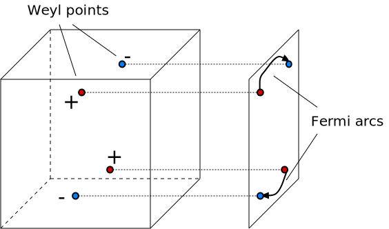

---
jupytext:
  text_representation:
    extension: .md
    format_name: myst
    format_version: 0.13
    jupytext_version: 1.11.4
kernelspec:
  display_name: Python 3
  language: python
  name: python3
---

# Topology in gapless systems

```{code-cell} ipython3
:tags: [remove-cell]

import sys

sys.path.append("../code")
from init_course import *

init_notebook()
from matplotlib import cm
from matplotlib.colors import hsv_to_rgb

pi_ticks = [(-np.pi, r"$-\pi$"), (0, "$0$"), (np.pi, r"$\pi$")]
```

## Introduction

Ashvin Vishwanath from the University of California, Berkeley will introduce Weyl semimetals and other examples of gapless, yet topological, systems.

```{code-cell} ipython3
:tags: [remove-input]

Video("MAWwa4r1qIc")
```

## Topological invariants of Fermi surfaces

The idea that leads us to the topology of gapless systems is extremely simple. It is:

> If we consider momentum as an external conserved parameter, we can study topological closings of the gap in momentum space.

Let's consider the simplest type of topological invariant, one we learned about at the very beginning of this course. Remember the simplest topological invariant of a 0D Hamiltonian, the number of filled energy levels? What if we take two points in momentum space, $\mathbf{k}_1$ and $\mathbf{k}_2$, and consider a Hamiltonian such that the number of filled states changes by $n$ between these two points? We can conclude that there are at least $n$ Fermi surfaces that lie on every path between $\mathbf{k}_1$ and $\mathbf{k}_2$ in momentum space.

Now we just need to take this idea and apply it to more interesting systems and topological invariants!

What types of topological invariants are relevant? Aside from special circumstances, we cannot make use of time-reversal or particle-hole symmetries: in momentum space these only have an immediate effect in isolated $\mathbf{k}$-points, where every momentum component is either $0$ or $\pi$. So there are no paths in momentum space for which either of the symmetries is effective in each point.

So we are left with only two symmetry classes: A and AIII (no symmetry at all or sublattice/chiral symmetry), and with only two invariants: if there is a sublattice symmetry, a winding number can be defined, and without it there's a Chern number.

## Graphene and protected Dirac cones

We've already analysed the 0D Chern number that stabilizes the usual Fermi surfaces. Let's go one dimension higher, and study winding numbers in systems with sublattice symmetry around 1D loops. 

For a winding number to be nonzero, we need to consider 1D loops in momentum space. As a reminder, with sublattice symmetry the Hamiltonian can always be brought to the form

$$
H = \begin{pmatrix}
0 & h(\mathbf{k}) \\
h^\dagger(\mathbf{k}) & 0
\end{pmatrix}
$$

The topological invariant is a nonzero winding of $\det h(\mathbf{k})$ when $\mathbf{k}$ goes around some contour. Since $h(\mathbf{k})$ is continuous, this means that its determinant also has to vanish somewhere inside this contour.

To study a particular example where this appears, let's return to graphene, which we studied as a simple limit of Haldane model. For graphene we have the Hamiltonian

$$
h(k_x, k_y) = t_1 e^{i \mathbf{k} \cdot \mathbf{a_1}} + t_2 e^{i \mathbf{k} \cdot \mathbf{a_2}} + t_3 e^{i \mathbf{k} \cdot \mathbf{a_3}},
$$

where $t_1, t_2, t_3$ are the three hoppings connecting a site in one of the two graphene sublattices, and $a_1, a_2, a_3$ are the lattice vectors connecting one unit cell to its neighbors.

To consider something specific, let's take $t_2 = t_3 = t$ and vary $t_1$. This is what the band structure and $\det h$ look like:

```{code-cell} ipython3
:tags: [remove-input]

%%output size=150 fig='png'


def plot_dets(syst, p, ks, chiral=False):
    B = np.array(syst.symmetry.periods).T
    A = B @ np.linalg.inv(B.T @ B)

    def momentum_to_lattice(k):
        k, residuals = np.linalg.lstsq(A, k, rcond=-1)[:2]
        return list(k)

    syst = kwant.wraparound.wraparound(syst).finalized()
    kys, kxs = np.meshgrid(ks, ks)
    dets = np.zeros_like(kxs, dtype=complex)
    for i, kx in enumerate(ks):
        for j, ky in enumerate(ks):
            kx, ky = momentum_to_lattice([kx, ky])
            ham = syst.hamiltonian_submatrix(params=dict(**p, k_x=kx, k_y=ky))
            if chiral:
                # Bring the chiral symmetric Hamiltonian in offdiagonal form
                U = (pauli.s0 + 1j * pauli.sx) / np.sqrt(2)
                ham = U @ ham @ U.T.conjugate()
            dets[i, j] = ham[1, 0]
    H = np.angle(dets) / (2 * np.pi)
    V = np.abs(dets)
    H = np.mod(H, 1)
    V /= np.max(V)
    V = 1 - V ** 2
    S = np.ones_like(H)
    HSV = np.dstack((H, S, V))
    RGB = hsv_to_rgb(HSV)
    bounds = (ks.min(), ks.min(), ks.max(), ks.max())
    pl = holoviews.RGB(RGB, bounds=bounds, label=r"$\det(h)$", kdims=["$k_x$", "$k_y$"])
    return pl.opts(plot={"xticks": pi_ticks, "yticks": pi_ticks}).opts(
        style={"interpolation": None}
    )


lat = kwant.lattice.honeycomb()
a, b = lat.sublattices
graphene = kwant.Builder(kwant.TranslationalSymmetry(*lat.prim_vecs))
graphene[lat.shape(lambda pos: True, (0, 0))] = 0
graphene[kwant.builder.HoppingKind((0, 0), a, b)] = lambda site1, site2, t_1: t_1
graphene[kwant.builder.HoppingKind((0, 1), a, b)] = lambda site1, site2, t_23: t_23
graphene[kwant.builder.HoppingKind((-1, 1), a, b)] = lambda site1, site2, t_23: t_23


p = dict(t_1=1.0, t_23=1.0)
ks = np.sqrt(3) * np.linspace(-np.pi, np.pi, 80)
kwargs = dict(
    title=(lambda p: rf"Graphene, $t_1 = {p['t_1']:.2} \times t$"), zticks=3
)
ts = np.linspace(1, 2.4, 8)
(
    holoviews.HoloMap(
        {p["t_1"]: spectrum(graphene, p, k_x=ks, k_y=ks, **kwargs) for p["t_1"] in ts},
        kdims=["$t_1$"],
    )
    + holoviews.HoloMap(
        {p["t_1"]: plot_dets(graphene, p, ks) for p["t_1"] in ts}, kdims=["$t_1$"]
    )
)
```

The left panel shows the band structure, and you see that it has gapless points. The right panel shows $\det h$ by using hue as a phase and intensity as magnitude (so white is $\det h = 0$). There are two Dirac points (you see 6, but this is because we plot more than one Brillouin zone). 

We also see that the winding numbers around these two Dirac points have opposite signs (because by going around them clockwise you encounter red, blue and green colors in opposite orders). This must always be the case since the winding number around the edges of the complete Brillouin zone must vanish - as you walk down every edge of the Brillouin zone twice in opposite directions, their contributions always cancel.

As $t_1$ increases, the two poles move towards each other, eventually annihilating and leaving a completely gapped dispersion relation. Let's now try to obtain an effective model for the dispersion at each pole and at the phase transition point.

We know that $\det h$ has to vanish next to some point $\mathbf{k}_0$. We can expand the Hamiltonian to a linear order next to this point, which immediately leaves us with a Hamiltonian

$$
H(\mathbf{k}) =
\begin{pmatrix}
0 & e^{i\alpha} (v_x \delta k_x + i v_y \delta k_y) \\
e^{-i\alpha} (v_x \delta k_x - i v_y \delta k_y) & 0
\end{pmatrix},
$$

where $\mathbf{\delta k}$ is of course the difference between $\mathbf{k}$ and the Dirac point momentum. Of course this is the 2D Dirac equation, which should be very familiar now.

At the phase transition where the two Dirac points annihilate, we can also quickly guess that the correct dispersion should be a quadratic function along the axis connecting the two Dirac points, and linear along the other axis (this is also what we see in the plot). We thus have

$$
H(\mathbf{k}) =
\begin{pmatrix}
0 & e^{i\alpha} (\beta \delta k_1^2 + m + i v_2 \delta k_2) \\
e^{-i\alpha} (\beta \delta k_1^2 + m - i v_2 \delta k_2) & 0
\end{pmatrix},
$$

such that for $m>0$ we have a fully gapped Hamiltonian, and for $m<0$ there are two Dirac points.

## $d$-wave superconductors and edge states

Gapless points with Dirac dispersion were known for quite some time before graphene. They exist in the cuprate family of high temperature superconductors, known to have a $d$-wave order parameter. These materials are layered, with weak couplings between the layers, so in the study of these complicated systems, one often starts with a simplified two-dimensional Hamiltonian.

This Hamiltonian just has the usual kinetic energy term of a single particle band and a superconducting pairing proportional to $k_x^2 - k_y^2$, namely

$$
H = \begin{pmatrix}
k^2/2m -\mu & \Delta (k_x^2 - k_y^2) \\
\Delta (k_x^2 - k_y^2) & \mu-k^2/2m
\end{pmatrix}.
$$

There is no spin-orbit coupling here, so the Hamiltonian has a spinless time-reversal symmetry $H = H^*$. It also has a particle-hole symmetry $H= - \tau_y H^* \tau_y$. Their product, the chiral symmetry $H = -\tau_y H \tau_y$ allows the Hamiltonian to have gapless points where both the single-particle dispersion and the pairing vanish.

### Difference between sublattice symmetries

Time-reversal symmetry ensures that the winding points come in pairs at opposite momenta, just like in graphene.
In graphene however, the chiral symmetry operator $\sigma_z$ commutes with the time-reversal symmetry operator. This means that applying time-reversal symmetry changes the direction of a loop in momentum space, but leaves the winding number invariant. In $d$-wave superconductors on the other hand, the chiral symmetry operator $\tau_y$ is odd under time-reversal (i.e. the operators anticommute), and the winding is invariant under it.

This means that a Dirac point at momentum $k$ and positive winding must come together with a Dirac point at $-k$ and also positive winding. Since the total winding over the Brillouin zone must be 0, this means that in superconducting systems the Dirac points come in quadruplets: two with positive winding and two with negative winding.

The $d$-wave superconductor Hamiltonian gives just that: there are 4 Dirac points at $|k_x| = |k_y| = k_F / \sqrt{2}$.

```{code-cell} ipython3
:tags: [remove-input]

question = r"What happens if you make the 2D $d$-wave Hamiltonian 3D, by adding coupling between 2D layers?"

answers = [
    "The Dirac points couple and gap out.",
    "In 3D you cannot have a $d$-wave pairing.",
    "There will remain isolated gapless points in the larger 3D Brillouin zone.",
    "You get a closed 1D Dirac line of gap closings in the 3D Brillouin zone.",
]

explanation = (
    r"The real and imaginary parts of the solutions of $\det h(\mathbf{k})=0$ form two surfaces "
    r"in the Brillouin zone. The intersection of these two surfaces is a line."
)

MultipleChoice(
    question=question, answers=answers, correct_answer=3, explanation=explanation
)
```

### Edge states

Now let's see how bulk-edge correspondence can be made to work for gapless systems. The idea here is to consider the projection of the wave vector parallel to a continuous sample boundary $k_\parallel$ as a parameter, and to apply the bulk-edge correspondence to the remaining lower-dimensional Hamiltonian.

Whenever the line corresponding to a constant $k_\parallel$ crosses a Dirac point, the winding number of the Hamiltonian $H(k_\parallel)$ changes by the winding of the Dirac point. This means that for certain values of momentum parallel to the boundary, a zero energy edge state will appear.

For a $d$-wave superconductor this will only happen for some crystalline orientations, as you can see for yourself:

```{code-cell} ipython3
:tags: [remove-input]

%%opts VLine (color='k')  Curve (linestyle='--')

def onsite(site, t, mu):
    return (4 * t - mu) * pauli.sz

def hopx(site1, site2, t, delta):
    return -t * pauli.sz - delta * pauli.sx

def hopy(site1, site2, t, delta):
    return -t * pauli.sz + delta * pauli.sx

lat = kwant.lattice.square()
dwave_infinite = kwant.Builder(kwant.TranslationalSymmetry(*lat.prim_vecs))
dwave_infinite[lat(0, 0)] = onsite
dwave_infinite[kwant.HoppingKind((1, 0), lat)] = hopx
dwave_infinite[kwant.HoppingKind((0, 1), lat)] = hopy

W = 50
dwave_ribbon = kwant.Builder(kwant.TranslationalSymmetry((1, 0)))
dwave_ribbon.fill(dwave_infinite, (lambda site: 0 <= site.pos[1] < W), (0, 0))
dwave_diagonal = kwant.Builder(kwant.TranslationalSymmetry((1, 1)))
dwave_diagonal.fill(
    dwave_infinite,
    (lambda site: 0 <= site.pos[1] - site.pos[0] < W),
    (0, 0)
)

p = dict(mu=2.0, t=1.0, delta=1.0)

# Fermi momentum
k = np.arccos(1 - p["mu"] / p["t"] / 4)
ks = np.linspace(-np.pi, np.pi, 51)

det_plot = plot_dets(dwave_infinite, p, ks, chiral=True)

det_plot1 = (
    det_plot
    * holoviews.Curve(([-np.pi, np.pi], [np.pi, -np.pi]))
    * holoviews.Curve(([-np.pi, np.pi - 2 * k], [np.pi - 2 * k, -np.pi]))
    * holoviews.Curve(([-np.pi + 2 * k, np.pi], [np.pi, -np.pi + 2 * k]))
).relabel("$\det(h)$")

det_plot2 = det_plot * holoviews.VLine(k) * holoviews.VLine(-k)

kwargs = dict(k_x=ks, ylims=[-2, 2], xticks=pi_ticks, yticks=3)

(
    spectrum(dwave_diagonal, p, title="Ribbon with edge states", **kwargs)
    * holoviews.VLine(-2 * k)
    * holoviews.VLine(0)
    * holoviews.VLine(2 * k)
    + det_plot1
    + spectrum(dwave_ribbon, p, title="Ribbon without edge states", **kwargs)
    * holoviews.VLine(-k)
    * holoviews.VLine(k)
    + det_plot2
).cols(2)
```

On the right panels you once again see $\det h$, with added lines denoting different the values of $k_{\parallel}$ crossing the Dirac points. If the sample boundary is along the $(1, 0)$ axis, the Dirac points have coinciding $k_{\parallel}$, and their windings cancel, so that no single value of $k_{\parallel}$ carries an edge state.

On the other hand, the crystal boundary (1, 1), which lies at an angle $\pi/4$ with respect to the crystallographic axes, has a total winding of +2 at $k_{\parallel}=0$ and a winding of −1 for $k_{\parallel}=\pm k_F$. In this case, each $|k_{\parallel}|<k_F$ carries a single edge state.

These edge states were known to exist long before the discovery of topological insulators, and it is fascinating to see how they perfectly fit to the theory of topological phenomena!

## Weyl points

So far we've seen two examples of Dirac points in two dimensions, the surface of a 3D topological insulator and graphene. You might wonder, why don't we have such cones in three dimensions? These do indeed exist and are called Weyl points instead of Dirac points. The reason is historical - Dirac's equation for the electron (which  is in 3D) involves states with four components, two for the electron and two for the hole. The direct generalization of graphene to $3D$ that we will discuss involves states with two electron component. Such electron states with linear dispersion were studied first by Weyl, and have strange properties as we will illustrate below.

Let us start by writing the low-energy Hamiltonian for the three dimensional generalization of graphene:

$$
H({\bf k})=(\sigma_x k_x+\sigma_y k_y+\sigma_z k_z).
$$

Here you might think of $\sigma_{x,y,z}$ as the spin of the electron (just as on the surface of a topological insulator).

Next we try the usual thing we would do with a two-dimensional Dirac cone - namely see what happens when we gap it out by applying a magnetic field $\bf\sigma\cdot B$. Adding such a term, we find that the Hamiltonian transforms as follows:

$$
H({\bf k})\rightarrow H({\bf k})+{\bf\sigma\cdot B}={\bf\sigma\cdot (k+B)}.
$$

The key observation here is that the addition of a magnetic field effectively shifts the wave-vector as

$$
{\bf k}\rightarrow \tilde{\bf k}={\bf k+ B}.
$$

> So applying the most general perturbation we can think of does not gap out the Weyl point where the energy vanishes. Instead, the perturbation only shifts the Weyl point around in momentum space. This feels like some kind of topological protection.

```{code-cell} ipython3
:tags: [remove-input]

%%output fig='png'
%%opts Surface [azimuth=45]


def onsite(site, t, mu):
    return 6 * t * pauli.sz - mu * pauli.sz


def hopx(site1, site2, t):
    return 0.5j * t * pauli.sx - t * pauli.sz


def hopy(site1, site2, t):

    return -t * pauli.sz

def hopz(site1, site2, t):
    return 0.5j * t * pauli.sy - t * pauli.sz

W = 10
lat = kwant.lattice.cubic(norbs=2)
weyl_slab = kwant.Builder(kwant.TranslationalSymmetry([1, 0, 0], [0, 1, 0]))
weyl_slab[lat.shape((lambda pos: 0 <= pos[2] < W), (0, 0, 0))] = onsite
weyl_slab[kwant.HoppingKind((1, 0, 0), lat)] = hopx
weyl_slab[kwant.HoppingKind((0, 1, 0), lat)] = hopy
weyl_slab[kwant.HoppingKind((0, 0, 1), lat)] = hopz


p = dict(t=1.0)
mus = np.linspace(-0.4, 2, 13)

kwargs = dict(
    k_x=np.linspace(-np.pi, 0),
    k_y=np.linspace(-np.pi, np.pi),
    title=lambda p: f"Weyl semimetal, $\mu = {p['mu']:.2}$",
    num_bands=4,
)

holoviews.HoloMap({p["mu"]: spectrum(weyl_slab, p, **kwargs) for p["mu"] in mus}, kdims=[r"$\mu$"])
```

Is there a sense in which Weyl points are "topological"? They are clearly protected, but is there some topological reason for the protection? As in the rest of this section, the topology of gapless system becomes apparent by looking at the Hamiltonian in lower dimensional subspaces of momentum space. For the case of Weyl, the momentum space is three dimensional, so let us look at two dimensional subspaces of momentum space.

A natural subspace to choose is to fix $k_z=m$. The Weyl Hamiltonian then becomes that of a massive 2D Dirac cone

$$
H_{2D,Dirac}(k_x,k_y;m)\equiv H(k_x,k_y,k_z=m)=(\sigma_x k_x+\sigma_y k_y+m\sigma_z).
$$

As we talked about in week 4 with Chern insulators, the massive Dirac model has a Chern number, which changes by $1$ if $m$ changes sign. 

> So we can think of the Weyl Hamiltonian in the momentum planes at fixed $k_z$ as Chern insulators with Chern numbers $n_{Ch}=0$ (i.e. trivial) if $k_z < 0$ and $n_{Ch}=1$ (topological) if $k_z > 0$.  The Hamiltonian at $k_z=0$ is at the phase transition point of the Chern insulator, which supports a gapless Dirac point.

Systems with Weyl points are known as Weyl semimetals. Just like other topological phases, Weyl semimetals have an interesting surface spectrum. We can understand this easily by viewing the Weyl point as a stack of Chern insulators in momentum space. For any surface in a plane that contains the $z$-axis, we can treat $k_z$ as a conserved quantity. At this $k_z=m$, the Hamiltonian is just that of a Chern insulator with an appropriate Chern number. For the range of $k_z$ where the Chern number $n_{Ch}(k_z)=1$, the surface spectrum supports chiral edge states with an energy approximated at low energy by

$$
E(k_x,k_z)\approx v(k_z)k_x.
$$

We can consider the edge states over a range of $k_z$ together to visualize the "surface states". 

> The unique property of the surface states is that if we set $k_x=0$ then the energy vanishes on a line in the surface spectrum. This line actually terminates at $k_z=0$, where the Chern number changes. Such lines, which are referred to as "Fermi arcs," are the unique bounday properties (hence the bulk-boundary correspondence) of Weyl semimetals.

At large enough $k_z$, the two dimensional Hamiltonian $H_{2D,Dirac}(k_x,k_y;k_z)$ becomes trivial i.e. $n_{Ch}(|k_z|\rightarrow \infty)=0$. This means that if the Chern number is $n_{Ch}=1$ in a range of $k_z$, then $n_{Ch}(k_z)$ must change twice resulting in two Weyl points. So Weyl points come in pairs. These points map onto the ends of the Fermi arcs on the surface. 



```{code-cell} ipython3
:tags: [remove-input]

question = r"What protects the surface state of Weyl semi-metals from scattering inside the bulk Weyl point?"

answers = [
    "Chiral symmetry.",
    "The energy gap in the bulk.",
    "Absence of scattering.",
    "The non-zero Chern number of the bulk.",
]

explanation = (
    r"The bulk has gapless states due to the Weyl point. "
    "Therefore, only momentum conservation protects surface states from going into the bulk."
)

MultipleChoice(
    question=question, answers=answers, correct_answer=2, explanation=explanation
)
```
